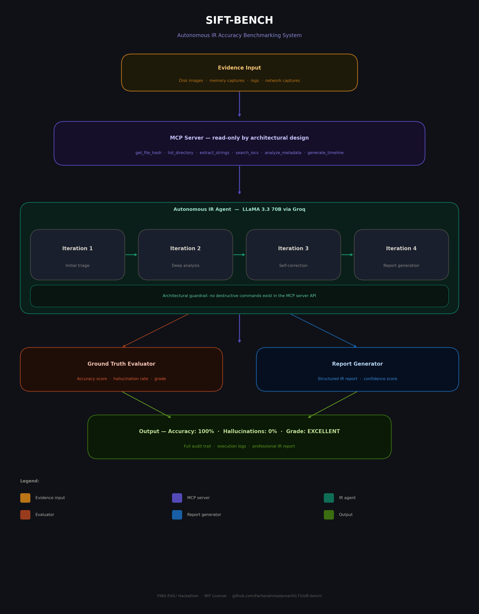

# SIFT-BENCH: Autonomous IR Accuracy Benchmarking System

> AI-powered IR agent that analyzes forensic evidence autonomously, measures its own accuracy against ground truth, and self-corrects — achieving 100% accuracy with 0% hallucinations.

Built for the **FIND EVIL! Hackathon** by SANS Institute.

## 🎬 Demo Video
👉 **https://youtu.be/l8ecBXzTuC4**

## 📂 Important Links
| Resource | Link |
|----------|------|
| 🎬 Demo Video | https://youtu.be/l8ecBXzTuC4 |
| 💻 GitHub Repo | https://github.com/Farhanahmadansari0173/sift-bench |
| 🏆 Devpost Submission | https://devpost.com/software/sift-bench-autonomous-ir-accuracy-benchmarking-system |
| 📊 Accuracy Report | https://github.com/Farhanahmadansari0173/sift-bench/blob/main/docs/accuracy_report.md |
| 📋 Dataset Documentation | https://github.com/Farhanahmadansari0173/sift-bench/blob/main/docs/dataset_documentation.md |
| 🏗️ Architecture Diagram | https://github.com/Farhanahmadansari0173/sift-bench/blob/main/docs/architecture_diagram.png |
| 📝 Execution Logs | https://github.com/Farhanahmadansari0173/sift-bench/tree/main/logs |
| 📄 IR Reports | https://github.com/Farhanahmadansari0173/sift-bench/tree/main/reports |

---

## Results

| Metric | Score |
|--------|-------|
| Overall Accuracy | 100% |
| Hallucination Rate | 0% |
| True Positives | 7/7 |
| False Negatives | 0 |
| Hallucinations | 0 |
| Performance Grade | EXCELLENT |

---

## What It Does

SIFT-BENCH extends Protocol SIFT with:

- **Purpose-built MCP Server** — 7 read-only forensic tools. Agent cannot run destructive commands by architectural design
- **Autonomous IR Agent** — powered by LLaMA 3.3 70B via Groq, thinks like a senior analyst
- **Self-correction loop** — detects and fixes its own inconsistencies across 4 iterations
- **Ground truth evaluator** — measures accuracy, false positives, and hallucination rate
- **Professional report generator** — structured IR reports with confidence scoring
- **Full audit trail** — every tool call logged with timestamp and result

---

## Architecture


---

## Security Design — Architectural Enforcement

All MCP server tools are **read-only by architectural enforcement** — not prompt-based restrictions. The agent physically cannot run destructive commands because they do not exist in the server API.

**Safe functions exposed:**
- `get_file_hash()` — MD5/SHA256 integrity verification
- `list_directory()` — Evidence directory enumeration
- `extract_strings()` — String extraction with IOC detection
- `analyze_file_metadata()` — Timestamp and timestomp detection
- `search_iocs()` — IP, URL, registry key extraction
- `check_persistence_mechanisms()` — Startup/persistence detection
- `generate_timeline()` — Filesystem timeline generation

**Destructive functions NOT exposed:**
- No `delete_file()`
- No `execute_command()`
- No `write_file()`
- No `modify_registry()`

Evidence spoliation is **impossible by design**.

---

## Self-Correction Loop

| Iteration | Action | Result |
|-----------|--------|--------|
| 1 | Initial triage | Identifies suspicious files and timeline |
| 2 | Deep analysis | Extracts IOCs, hashes, strings for every file |
| 3 | Self-correction | Validates findings, flags contradictions, marks CONFIRMED/INFERRED/FALSE_POSITIVE |
| 4 | Report generation | Professional IR report with evidence citations |

---

## Project Structure
---

## Quick Start

### Requirements
- Python 3.11+
- Groq API key (free at https://console.groq.com)
- conda (recommended)

### Installation

```bash
# Clone the repository
git clone https://github.com/Farhanahmadansari0173/sift-bench.git
cd sift-bench

# Create environment
conda create -n sift-bench python=3.11 -y
conda activate sift-bench

# Install dependencies
pip install groq loguru python-dotenv rich google-genai
```

### Configuration

```bash
cp .env.example .env
# Edit .env and add your GROQ_API_KEY from https://console.groq.com
```

### Run

```bash
python main.py
```

### Expected Output
---

## Documentation

| Document | Link |
|----------|------|
| Architecture Diagram | [docs/architecture_diagram.png](docs/architecture_diagram.png) |
| Accuracy Report | [docs/accuracy_report.md](docs/accuracy_report.md) |
| Dataset Documentation | [docs/dataset_documentation.md](docs/dataset_documentation.md) |
| Execution Logs | [logs/](logs/) |
| IR Reports | [reports/](reports/) |

---

## Hackathon

Built for **FIND EVIL! Hackathon** by SANS Institute.
Architectural approach: **Custom MCP Server + Self-Correcting Agent + Ground Truth Benchmarking**

- 🏆 Devpost: https://devpost.com/software/sift-bench-autonomous-ir-accuracy-benchmarking-system
- 🎬 Demo: https://youtu.be/l8ecBXzTuC4
- 💻 GitHub: https://github.com/Farhanahmadansari0173/sift-bench

---

## License

MIT License — see [LICENSE](LICENSE) for details.
